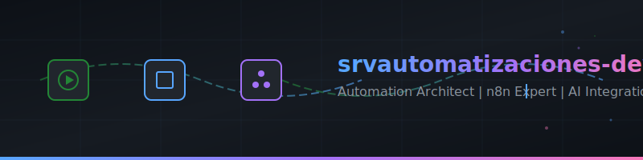

<!-- Animated Header -->
<div align="center">
  
</div>

<!-- Dynamic Typing SVG -->
<div align="center">
  <a href="https://git.io/typing-svg">
    
  </a>
</div>

<br/>

<!-- About section -->
## 🚀 About Me

```yaml
name: Santiago Velázquez
role: Founder @ AutomatiXa
location: Spain 🇪🇸
experience: 2-5 years in automation & integration
specialization:
  - Business Process Automation
  - API & System Integration
  - AI-powered Solutions with LLMs
  - Cloud Infrastructure (Docker, VPS)
  - MCP Server Design & Development
focus: Reducing operational friction and scaling businesses through intelligent automation
projects_completed: 28 projects across 7 sectors
compliance: GDPR/RGPD for healthcare projects
```

---

## 🛠️ Tech Stack

<div align="center">

### Automation Platforms
[](https://n8n.io)
[](https://make.com)
[](https://zapier.com)

### AI & LLMs
[](https://openai.com)
[](https://anthropic.com)
[](https://deepmind.google/technologies/gemini/)
[](https://ollama.ai)
[](https://openai.com/research/whisper)
[](https://modelcontextprotocol.io)

### Infrastructure & DevOps
[](https://docker.com)
[](https://docs.docker.com/engine/swarm/)
[](https://ubuntu.com)
[](https://traefik.io)
[](https://portainer.io)
[](https://hetzner.com)

### Databases
[](https://postgresql.org)
[](https://mongodb.com)
[](https://supabase.com)

### Messaging & APIs
[](https://business.whatsapp.com)
[](https://evolution-api.com)
[](https://telegram.org)
[](https://api.slack.com)

### Languages & Tools
[](https://javascript.com)
[](https://typescriptlang.org)
[](https://python.org)
[](https://nodejs.org)
[](https://postgresql.org)
[](https://gnu.org/software/bash/)
[](https://developers.google.com/apps-script)

### Frontend & UI
[](https://react.dev)
[](https://developer.mozilla.org/docs/Web/HTML)
[](https://developer.mozilla.org/docs/Web/CSS)
[](https://tailwindcss.com)

### Document Processing
[](https://cloud.google.com/vision)
[](https://pptr.dev)

</div>

---

## 💻 Technical Proficiency

<div align="center">

| Language / Tool | Level | Primary Use |
|:---------------:|:-----:|:-----------:|
| **JavaScript / Node.js** | ⭐⭐⭐⭐⭐ Advanced | Backend, Automations, APIs |
| **Python** | ⭐⭐⭐⭐⭐ Advanced | Scripts, Data Processing, AI |
| **SQL** | ⭐⭐⭐⭐⭐ Advanced | PostgreSQL, Complex Queries |
| **TypeScript** | ⭐⭐⭐⭐ Intermediate-Advanced | Typed Development, APIs |
| **Bash / Shell** | ⭐⭐⭐⭐⭐ Advanced | DevOps, Server Scripting |
| **Apps Script** | ⭐⭐⭐⭐⭐ Advanced | Google Workspace Automation |
| **HTML / CSS / Tailwind** | ⭐⭐⭐⭐ Intermediate | Frontend, Web Interfaces |

</div>

---

## 📊 Industry Expertise

<div align="center">

| Sector | Projects | Specialization | Impact |
|:------:|:--------:|:--------------:|:------:|
| 🏥 **Healthcare** | 6 | Clinical chatbots, IOL calculators, MRI safety | GDPR Compliant |
| 🛒 **Sales / E-commerce** | 6 | CRM integration, multichannel automation | 24/7 Operations |
| 📄 **Productivity / Office** | 6 | OCR, transcription, document management | 90% less manual work |
| 🏠 **Real Estate / Rentals** | 6 | OTA sync, property management, guest bots | Full automation |
| 📢 **Marketing / Lead Gen** | 4 | B2B scraping, data enrichment | Automated prospecting |
| 🏭 **Industrial / Manufacturing** | 3 | Product configurators, AI assistants | 70% time reduction |
| 🏛️ **Public Administration** | 1 | Citizen listening platform with AI | Multi-channel |

</div>

---

## 🔥 Featured Projects

<div align="center">

### 🏥 Healthcare (6 Projects)
```
👁️ IOL Calculator
   ├── Intraocular lens calculation system for eye surgery
   ├── OpenAI API + PostgreSQL + n8n
   └── Clinical precision automation

🧲 MRI Safety System
   ├── Automated patient compatibility verification
   ├── Medical device database integration
   └── WhatsApp Business API notifications

🏥 Hospital WhatsApp Bot
   ├── Appointment management & patient queries
   ├── Evolution API + Claude API
   └── 24/7 automated healthcare support

👨‍⚕️ Clinical AI Assistant
   ├── Healthcare professional support agent
   ├── OpenAI + PostgreSQL + Docker
   └── Medical knowledge base integration

📅 Medical Appointment System
   ├── Scheduling automation & reminders
   ├── Google Calendar + WhatsApp integration
   └── Reduced no-show rates

📋 Clinical Report Processing
   ├── Automated data extraction & classification
   ├── OCR + OpenAI Vision
   └── Structured medical data output
```

### 🏭 Industrial / Manufacturing (3 Projects)
```
🏗️ Palfinger Crane Configurator
   ├── AI chatbot for industrial crane configuration
   ├── Claude Sonnet + State Machine + Anti-loop
   └── PostgreSQL chat memory persistence

⚙️ Production Line Automation
   ├── Process control & monitoring flows
   ├── REST APIs + PostgreSQL
   └── Real-time production tracking

📦 Inventory Management System
   ├── Automated stock control & movements
   ├── Webhooks + PostgreSQL
   └── Multi-warehouse synchronization
```

### 🛒 Sales / E-commerce (6 Projects)
```
🛍️ Order Processing Automation
   ├── Multichannel order flow automation
   ├── REST APIs + PostgreSQL
   └── End-to-end fulfillment tracking

🔗 CRM Integration Hub
   ├── HubSpot, Pipedrive bidirectional sync
   ├── Webhooks + n8n orchestration
   └── Unified customer data

🤖 E-commerce Support Bot
   ├── Customer service chatbot
   ├── WhatsApp + OpenAI API
   └── Automated query resolution

📊 Multichannel Inventory Sync
   ├── Stock unification across platforms
   ├── REST APIs + PostgreSQL
   └── Real-time availability updates

💳 Payment Gateway Integration
   ├── Stripe automation & reconciliation
   ├── Webhooks + n8n flows
   └── Automated payment processing

🧾 Automated Invoicing
   ├── Invoice generation & delivery
   ├── Google Sheets + Email APIs
   └── Batch document processing
```

### 🏠 Real Estate / Rentals (6 Projects)
```
🏨 Booking/Airbnb Sync
   ├── Calendar & reservation unification
   ├── OTA APIs + PostgreSQL
   └── Zero double-booking guarantee

🔑 Check-in/Check-out Automation
   ├── Guest entry/exit workflows
   ├── WhatsApp + Smart lock APIs
   └── Contactless operations

🏢 Property Management (INEA)
   ├── Comprehensive property administration
   ├── PostgreSQL + REST APIs
   └── Owner & tenant portals

💬 Guest/Tenant Support Bot
   ├── 24/7 conversational assistant
   ├── WhatsApp + OpenAI
   └── Instant query resolution

📄 Rental Invoicing System
   ├── Automated receipt generation
   ├── Google Sheets + Email APIs
   └── Payment tracking

🔧 Maintenance Ticketing
   ├── Issue tracking & resolution
   ├── PostgreSQL + Telegram notifications
   └── Vendor coordination
```

### 📢 Marketing / Lead Generation (4 Projects)
```
🔍 B2B Lead Scraping
   ├── LinkedIn & directory extraction
   ├── Puppeteer + PostgreSQL
   └── Automated prospecting pipeline

📈 Contact Data Enrichment
   ├── Prospect validation & expansion
   ├── Enrichment APIs + PostgreSQL
   └── Higher conversion rates

🔗 Lead-to-CRM Integration
   ├── Automated CRM synchronization
   ├── HubSpot + Webhooks
   └── Zero manual data entry

💬 Web Lead Capture Bot
   ├── Visitor qualification chatbot
   ├── OpenAI + Webhooks
   └── Instant lead scoring
```

### 📄 Productivity / Office (6 Projects)
```
🎙️ Meeting Transcription AI
   ├── Audio-to-text with smart summaries
   ├── OpenAI Whisper + Google Drive
   └── Actionable meeting insights

📑 Invoice OCR Processing
   ├── Automated data extraction
   ├── OpenAI Vision + Google Sheets
   └── 90% faster processing

📊 Google Sheets Automation
   ├── Data transformation flows
   ├── Apps Script + n8n
   └── Complex reporting automation

💬 Slack/Teams/Telegram Integration
   ├── Cross-platform notifications
   ├── Multiple messaging APIs
   └── Unified communication hub

📅 Calendar Synchronization
   ├── Multi-calendar unification
   ├── Google Calendar API
   └── Conflict-free scheduling

📁 Document Management AI
   ├── Automated classification & organization
   ├── Google Drive + OpenAI
   └── Intelligent file routing
```

### 🏛️ Public Administration (1 Project)
```
🏝️ ADAI - Citizen Listening Platform (Canary Islands)
   ├── Multi-channel citizen communication
   ├── Web + Telegram + WhatsApp
   ├── AI-powered message classification
   └── PostgreSQL + Docker + OpenAI
```

### 🍔 Gastronomy (1 Project)
```
🍔 Antonella - AI Gastronomy Assistant
   ├── WhatsApp customer service chatbot
   ├── Complaint management & suggestions
   ├── Menu guidance & recommendations
   └── OpenAI + Evolution API + n8n
```

</div>

---

## 📈 GitHub Stats

<div align="center">
  
  

</div>

<div align="center">
  
</div>

<!-- Activity Graph -->
<div align="center">
  
</div>

---

## 🤝 Connect With Me

<div align="center">

[](https://automatixa.com)
[](https://linkedin.com/in/tu-perfil)
[](mailto:contacto@automatixa.com)

</div>

---

<div align="center">
  
  
  
  <sub>⚡ Transforming manual processes into automated workflows since 2020</sub>
  
</div>

<!-- Snake animation -->
<div align="center">
  <picture>
    <source media="(prefers-color-scheme: dark)" srcset="https://raw.githubusercontent.com/srvautomatizaciones-dev/srvautomatizaciones-dev/output/github-snake-dark.svg" />
    <source media="(prefers-color-scheme: light)" srcset="https://raw.githubusercontent.com/srvautomatizaciones-dev/srvautomatizaciones-dev/output/github-snake.svg" />
    
  </picture>
</div>